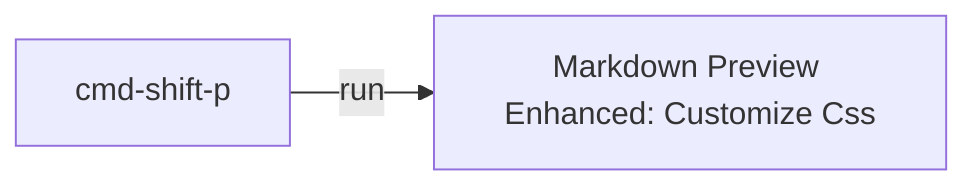

# Dashboard

- [[goals]]
- [[daily.journal]]

* * *

### As the old saying goes: Give a man a fish and you feed him for a day. Teach a man to fish and you feed him for a lifetime.


## Tomorrow tasks:

- [ ] my new Digital-Garden/blog
- [ ] new CV
- [ ] new LinkedIn profile/blog

## Should do

- [ ] Flow trailhead
- [ ] working with me - based on SF guidelines in resources/ career exploration sourcepack
- [ ] [Vista Portfolio for jobs](https://www.vistaequitypartners.com/companies/portfolio/)
- [ ] new quest: https://trailhead.salesforce.com/superbadges
- [ ] cert guides: https://www.salesforce.com/content/dam/web/en_us/www/documents/datasheets/certification-guide.pdf
- [ ] [MuleSoft trails](https://trailhead.salesforce.com/content/learn/modules/mulesoft-composer-install-and-config)
 


## Recurrent to-do:

## career

## Reference:

```
- [ ] : not started
- [w] : work in progress
- [x] : done
- [?] : feedback
- [>] : postponed
```

* * *

How to style MD:



